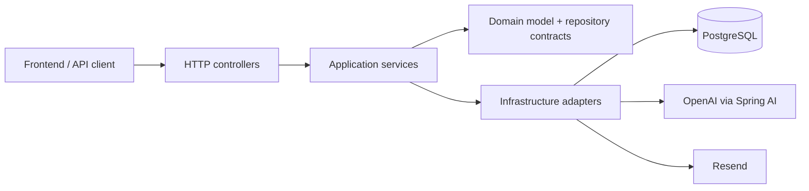
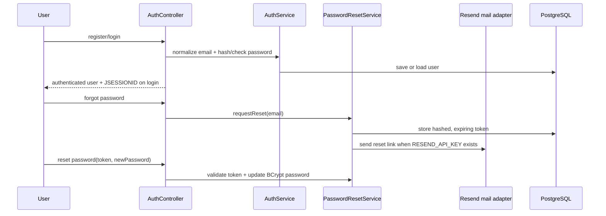
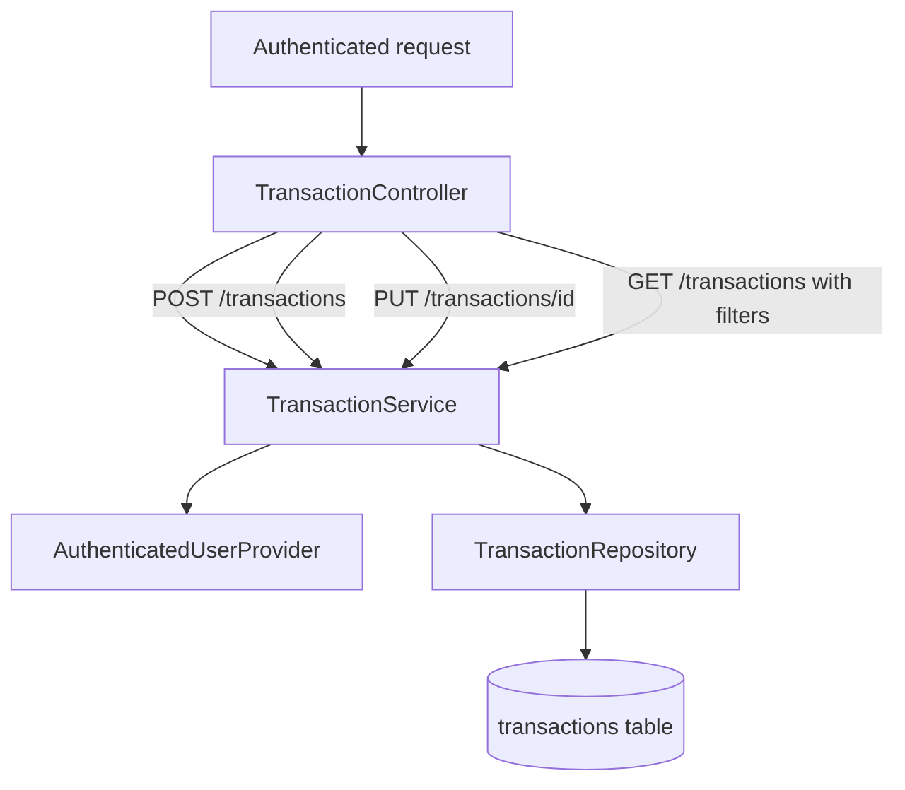
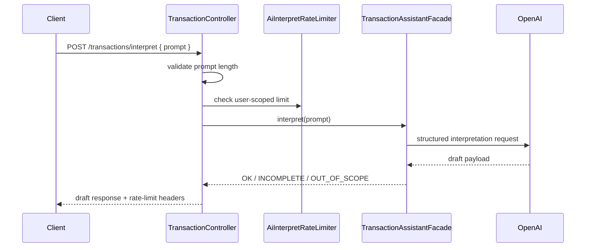
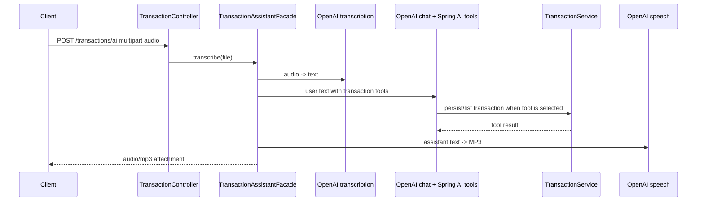

# Budgeting Backend

Backend API for the Budgeting MVP: a Spring Boot service that lets an authenticated user manage expenses manually and use AI-assisted text or voice capture for Spanish personal spending prompts.

The project is intentionally lean. It uses pragmatic layered architecture, PostgreSQL persistence, Spring Security sessions, Flyway migrations, and Spring AI/OpenAI for interpretation, transcription, tool calling, and speech output.

## Current MVP surface

| Area | Endpoints | Purpose |
|------|-----------|---------|
| Auth | `POST /auth/register`, `POST /auth/login`, `POST /auth/logout`, `GET /auth/me` | Email/password registration and session login. |
| Password reset | `POST /auth/forgot-password`, `POST /auth/reset-password` | Token-based reset link flow; email delivery uses Resend when configured. |
| Budget | `GET /auth/me/weekly-budget`, `PUT /auth/me/weekly-budget` | Read/update the authenticated user's weekly budget. |
| Transactions | `POST /transactions`, `PUT /transactions/{id}`, `GET /transactions`, `GET /transactions/{category}` | Manual expense creation/update plus owner-scoped history and category lookup. |
| Dashboard | `GET /dashboard/spending` | Current-month spending summary. Accepts optional `Time-Zone` header. |
| AI text capture | `POST /transactions/interpret` | Converts a natural-language expense prompt into a draft response for user review. |
| AI voice capture | `POST /transactions/ai` | Audio upload -> transcription -> LLM tool calling -> MP3 response. |
| AI utilities | `POST /api/transcribe`, `POST /api/sinthesize`, `GET /api/chat-client`, `GET /api/chat-model` | Demo/utility endpoints for individual AI capabilities. `sinthesize` is intentionally spelled this way for compatibility. |

All non-auth endpoints are protected by Spring Security. Login creates an HTTP-only `JSESSIONID`; CSRF protection uses Spring's cookie token repository.

## Stack

| Component | Current choice |
|-----------|----------------|
| Runtime | Java 25 |
| Framework | Spring Boot 4.0.6 |
| AI | Spring AI 2.0.0-M4 with OpenAI chat, Whisper transcription, and TTS models |
| Database | PostgreSQL 16 via Docker Compose |
| Persistence | Spring Data JPA with `ddl-auto=validate` |
| Migrations | Flyway SQL migrations in `src/main/resources/db/migration` |
| Security | Spring Security sessions + BCrypt password hashing |
| Email | Resend REST API for password reset delivery |

## Architecture at a glance



The official MVP decision is **pragmatic Layered Architecture with clean boundaries**:

- `domain/` owns business concepts such as transactions, categories, users, and repository contracts.
- `application/` orchestrates use cases, authenticated ownership, transaction boundaries, and dashboard calculations.
- `infraestructure/` contains HTTP, JPA, Spring Security, Spring AI, email, and framework adapters.
- `config/` wires Spring Boot, Flyway, security, and application properties.

`infraestructure` is misspelled in package names on purpose for compatibility. Do not rename it casually.

## Core flows

### Auth and password reset



Defensible choices: email normalization, BCrypt password hashing, hashed reset tokens, token expiry, used-token invalidation, and non-enumerating forgot-password behavior.

### Manual transaction and history



Manual capture stays available even when AI is unavailable. Transaction reads and writes are scoped to the current authenticated user; history supports optional `from`, `to`, and `category` filters and returns totals with the item list.

### Text AI interpretation



This endpoint returns a draft for review; it does not persist the transaction by itself.

### Voice AI tool-calling flow



This is the demo voice flow. It intentionally combines transcription, LLM tool calling, application use cases, and TTS into a single endpoint.

## Local setup

1. Copy the local environment template:

   ```bash
   cp .env.example .env
   ```

2. Fill values you need:

   | Variable | Purpose |
   |----------|---------|
   | `OPENAI_API_KEY` | Required for real AI flows and AI integration tests. |
   | `POSTGRES_USER`, `POSTGRES_PASSWORD`, `POSTGRES_DB` | Optional local database overrides. Defaults match Compose. |
   | `RESEND_API_KEY`, `RESEND_SENDER` | Optional password reset email delivery. Missing API key skips sending and logs a warning. |
   | `PASSWORD_RESET_BASE_URL`, `PASSWORD_RESET_TOKEN_TTL` | Password reset link base URL and token lifetime. |

3. Run the full stack:

   ```bash
   docker compose up -d --build
   ```

   The API is exposed at `http://localhost:8080`.

For IDE/JVM runs, start only the database and then run the app locally:

```bash
docker compose up -d database
./gradlew bootRun
```

## Tests and verification

Use the Gradle wrapper:

```bash
./gradlew test
```

Useful focused checks:

```bash
./gradlew test --tests "dio.budgeting.BudgetingApplicationTests"
./gradlew test --tests "dio.budgeting.infraestructure.persistence.FlywayMigrationIT"
./gradlew test --tests "dio.budgeting.infraestructure.ai.ToolCallingIT"
```

Notes for reviewers:

- `OPENAI_API_KEY` is required for real AI flows; OpenAI integration tests are gated by environment and call the real API when enabled.
- `FlywayMigrationIT` is the safest deterministic integration check because it uses Testcontainers PostgreSQL and no OpenAI credentials.
- `spring.jpa.hibernate.ddl-auto=validate` means persistence changes must include matching Flyway migrations.
- `src/main/java/dio/budgeting/config/FlywayConfig.java` is load-bearing for Boot 4 startup ordering; do not remove it without proving startup still works.

## MVP constraints worth preserving

- Keep the documentation set minimal: README plus the architecture/defense note in `docs/ARCHITECTURE_DECISION.md` are enough for the current backend.
- Keep manual transaction paths available even if AI flows fail.
- Preserve `/api/sinthesize` spelling unless a compatibility-breaking API rename is explicitly planned.
- Treat strict Hexagonal or full Clean Architecture as out of scope for this MVP; evolve only when real complexity justifies it.
