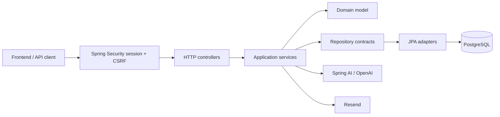
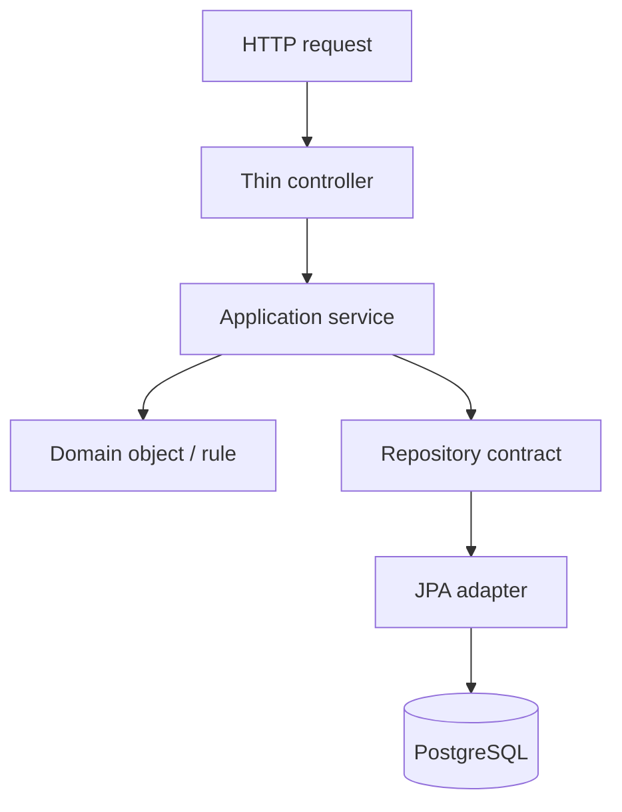
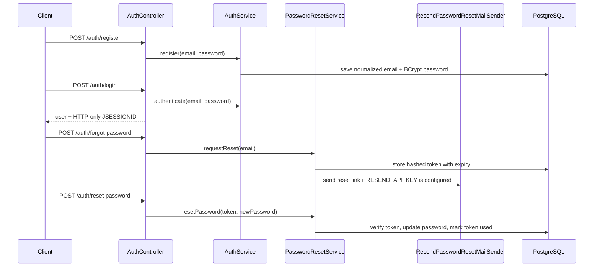
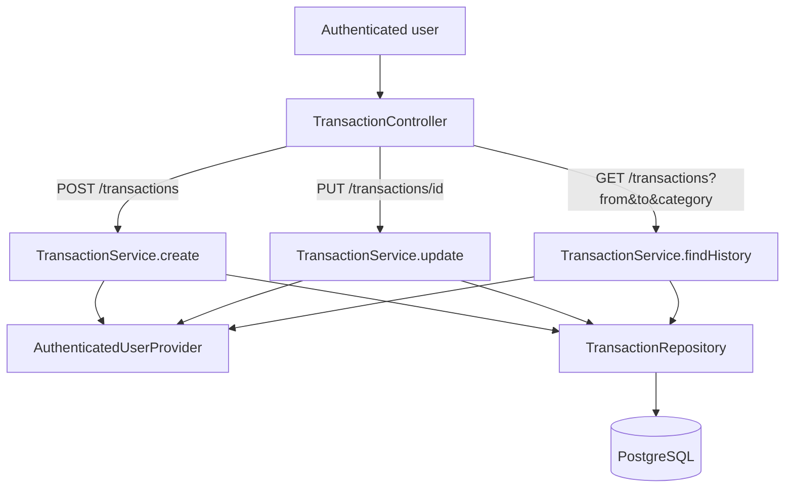
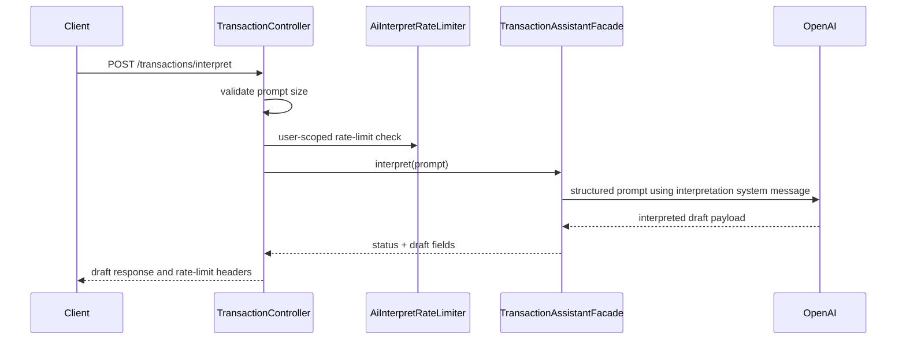
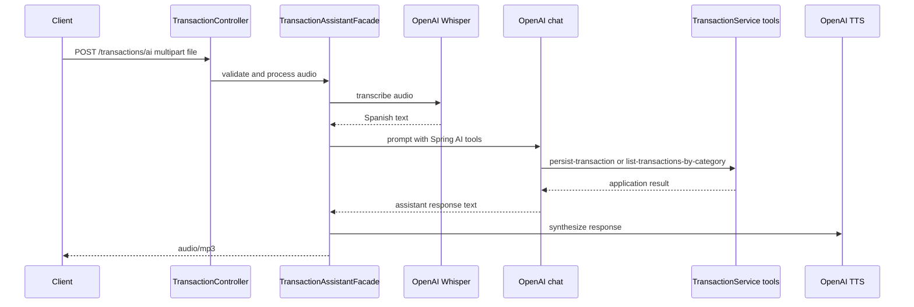

# Architecture decision — Budgeting MVP backend

## Decision

Budgeting uses a **pragmatic Layered Architecture with clean boundaries**.

This is the right level of architecture for the MVP: clear enough to defend in review, simple enough to keep the codebase understandable, and not overloaded with strict Hexagonal or full Clean Architecture ceremony before the product needs it.

## Product context

The backend must support a credible personal-finance MVP:

- email/password authentication with session-based access;
- password reset by expiring token;
- manual transaction creation, update, category lookup, and filtered history;
- dashboard spending summary;
- AI text interpretation that returns a draft for user review;
- AI voice flow that accepts audio, transcribes it, lets the LLM call transaction tools, and returns spoken audio.

The goal is not to build a financial platform framework. The goal is to demonstrate a coherent backend that can be explained, tested, and evolved.

## System shape

| Layer | Responsibility | Examples |
|-------|----------------|----------|
| HTTP / transport | Request mapping, input/output DTOs, status codes, HTTP-specific errors. | `AuthController`, `TransactionController`, `DashboardController`, assistant demo controllers. |
| Application | Use-case orchestration, authenticated ownership, transactions, AI workflow coordination. | `AuthService`, `PasswordResetService`, `TransactionService`, `DashboardService`. |
| Domain | Business concepts and contracts that should not depend on HTTP/JPA. | `Transaction`, `Category`, `User`, repository interfaces. |
| Infrastructure | Technical adapters and framework integrations. | JPA repositories, Spring Security provider, Spring AI facade, Resend mail sender. |
| Config | Framework wiring and operational properties. | `SecurityConfig`, `FlywayConfig`, AI/auth properties. |

The package name `infraestructure` is intentionally preserved because it already exists in source and tests. Renaming it is a separate refactor, not part of the MVP defense.

## Why this is defensible

### Why layered architecture

Layered architecture matches the current backend because most flows are request/response use cases backed by PostgreSQL and a small number of external integrations. It keeps the common path easy to trace:

The important discipline is not the number of folders. It is that controllers stay thin, application services own use-case orchestration, domain concepts stay protected from framework details, and infrastructure remains replaceable at the edges.

### Why not strict Hexagonal now

Strict Hexagonal Architecture would add ports/adapters around almost every operation. That can be valuable when the domain must support many independent delivery mechanisms or interchangeable providers.

This MVP has a simpler shape:

- one primary delivery mechanism: REST;
- one relational database: PostgreSQL;
- one AI provider path through Spring AI/OpenAI;
- one password reset email adapter;
- small, direct domain rules.

Adding more indirection now would increase review and implementation cost without making the MVP safer.

### Why not full Clean Architecture now

Full Clean Architecture would introduce more interactors, boundaries, presenters, and DTO transformations than the current scope needs. The MVP keeps the useful parts — dependency direction, thin transport, isolated infrastructure, and testable services — without turning simple use cases into ceremony.

## Core flows

### 1. Auth and password reset

Defensive points:

- passwords are encoded with BCrypt;
- emails are normalized before lookup;
- reset tokens are stored as hashes, not raw tokens;
- reset tokens expire and are marked used;
- missing Resend configuration does not break the app, but skips email delivery with a warning.

### 2. Manual transaction creation, update, and history

Defensive points:

- manual expense entry is not coupled to AI availability;
- transaction operations are owner-scoped through the authenticated user;
- update checks the transaction belongs to the current user before saving;
- history accepts optional date and category filters and returns total amount plus count.

### 3. Text AI interpretation

Defensive points:

- this path returns a draft and does not persist by itself;
- prompt length, timeout, and rate limit are configurable;
- out-of-scope prompts are rejected instead of being forced into expenses;
- Argentine amount normalization is handled in the AI interpretation edge.

### 4. Voice AI flow

Defensive points:

- the endpoint demonstrates the full multimodal path in one reviewable flow;
- tool calling reaches the same `TransactionService` use cases used by manual endpoints;
- TTS compatibility endpoint remains `/api/sinthesize` with the current spelling.

## Operating constraints

- `spring.jpa.hibernate.ddl-auto=validate` means schema changes require Flyway migrations in the same change.
- `FlywayConfig` is load-bearing for Spring Boot 4.0.6 startup ordering and should not be simplified casually.
- Real AI flows require `OPENAI_API_KEY` and can call external OpenAI APIs during integration tests.
- Password reset email requires `RESEND_API_KEY`; without it, reset token generation still works but email sending is skipped.
- The current documentation set should stay small: README for usage and this file for architecture defense.

## Evolution rule

Move toward stricter Hexagonal/Clean boundaries only when real complexity appears: multiple delivery channels, provider replacement pressure, richer domain policy, or integration churn. Until then, the MVP wins by keeping boundaries clear and ceremony low.
